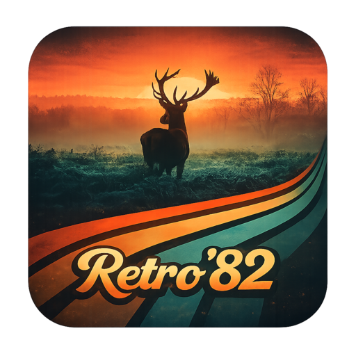

# Retro '82 Theme

Retro '82 for VS Code.

Built from the Retro '82 palette and tuned for stronger syntax and semantic highlighting across the languages most people actually use.



## Install

Install from the VS Code Marketplace:

```bash
code --install-extension oldjobobo.retro-82-theme
```

## Included

- Dark Retro '82 UI theme
- Semantic highlighting support
- Expanded syntax highlighting coverage for Rust, JavaScript, TypeScript, Python, Shell, Markdown, CSS, JSON, TOML, YAML, HTML, Lua, and diff views

## Highlighting Coverage

- `391` TextMate scopes themed
- `52` semantic token selectors themed
- Semantic highlighting enabled by the theme

## Notes

- Semantic highlighting is enabled by the theme.
- The theme is intended to keep the Retro '82 feel while improving symbol separation and readability in real projects.
